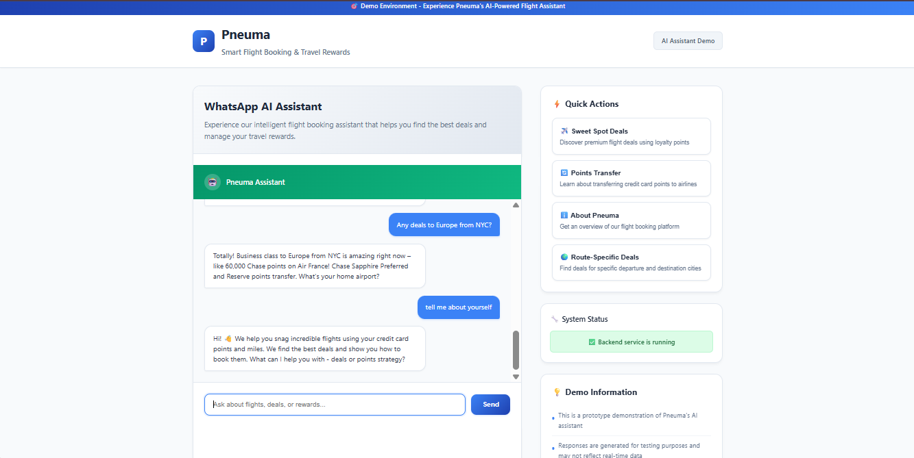

# 🧠 Pneuma Chatbot – Travel Rewards Assistant

A prototype chatbot that helps users explore **sweet-spot flight deals**, understand **mileage transfer strategies**, and get started with **travel rewards**, all in **Pneuma's friendly, plain-English voice**.

Built with:
- 🔧 Flask backend (Gemini API powered)
- 🌐 Responsive frontend (HTML/CSS/JS)
- ☁️ Deployed on [Render]([https://render.com](https://pneuma-chatbot.onrender.com/))

---

## 📸 Dashboard Preview

  
---

## 🎥 Demo Video

Watch a walkthrough of the chatbot and its features:  
[](https://drive.google.com/file/d/1jL_tZvo8A8YF67HkJiiSiJqUx0Mih4WE/view?usp=drive_link)


---

## 🎯 Core Features

**Three Smart Intents:**
1. 🛫 **Sweet Spot Deals** – Surface best redemption opportunities for routes like US → Europe/Asia
2. 🔁 **Mileage Transfer Help** – Understand how to transfer Chase, Amex, or Citi points
3. ❓ **General FAQs** – Explain Pneuma’s purpose and how it helps with travel rewards

---

## 🚀 Quick Setup

### 🧩 Prerequisites

- Python 3.8+
- (Optional) [ngrok](https://ngrok.com/) for webhook testing
- Gemini API key from [Google AI Studio](https://makersuite.google.com/app)

---

### 📦 Installation

```bash
# Clone this repo
git clone https://github.com/theUtkarshRaj/Pneuma-chatbot.git
cd Pneuma-chatbot/backend

# Install dependencies
pip install -r requirements.txt

# Create .env (optional for local dev)
echo "GENAI_API_KEY=your-gemini-api-key" > .env
````

---

### ▶️ Run Locally

```bash
python app.py
```

Then visit:
📍 [http://localhost:5000](http://localhost:5000)

---

## 🔁 API Endpoints

### 1. `/test` — Test Chatbot Logic

```bash
curl -X POST http://localhost:5000/test \
  -H "Content-Type: application/json" \
  -d '{"message": "What are the best sweet spot deals today?", "api_key": "your-gemini-api-key"}'
```

### 2. `/health` — Health Check

```bash
curl http://localhost:5000/health
```

Returns service status JSON.

---

## 💬 Sample Intents

| Intent Type       | User Example                                            |
| ----------------- | ------------------------------------------------------- |
| Sweet Spot Deals  | "Any cheap award flights to Europe?"                    |
| Mileage Transfers | "How do I move Chase points to United?"                 |
| General FAQ       | "What is Pneuma?" or "How do I get started with miles?" |

---

## 🌐 Deployment on Render

1. Go to [Render](https://render.com)
2. Click **"New Web Service"**
3. Connect your repo: `https://github.com/theUtkarshRaj/Pneuma-chatbot`
4. Set values:

   * **Root Directory**: `backend`
   * **Build Command**: `pip install -r requirements.txt`
   * **Start Command**: `gunicorn app:app`
5. **Environment Variable**:

   * `GENAI_API_KEY = your-gemini-key`
6. Deploy!

Your app will be live at:
🔗 `https://pneuma-chatbot.onrender.com`

---

## 📁 Folder Structure

```
Pneuma-chatbot/
├── backend/
│   ├── app.py               # Flask backend
│   ├── requirements.txt     # Dependencies
│   └── ...
├── frontend/
│   └── index.html           # Frontend UI
├── dashboard.png

```

---

## 🎨 Voice & Tone Guide

**✅ Use:**

* "Want a quick win? Here’s one:"
* "Points to Europe? Try Aeroplan."
* "Need help picking a card?"

**🚫 Avoid:**

* "Optimize your loyalty ecosystem"
* "Revolutionize your travel experience"

---

## ⚠️ Current Limitations

* No memory (each prompt is isolated)
* Keyword-based intent detection
* Gemini API key must be entered manually

---

## 📋 Sample Phrases by Intent

### Sweet Spot Deals

* "What are the best deals today?"
* "Show me sweet spot routes"
* "Any good value flights to Europe?"

### Mileage Transfer

* "How do I transfer Chase points?"
* "Transfer Amex to United?"
* "Best way to move points?"

### General FAQ

* "What is Pneuma?"
* "How does it work?"
* "Help me understand travel rewards"

---

## 🙌 Contribution

Feel free to fork and improve:

* Better intent classification
* Add memory/context
* Frontend UI enhancements

---

## 🧠 Powered By

* [Gemini API](https://makersuite.google.com/app)
* [Render]([dashboard-preview.png](https://pneuma-chatbot.onrender.com/](https://pneuma-chatbot.onrender.com/))
* Flask, HTML/CSS/JS

---

## 🧑‍💻 Author

Made with 💙 by [Utkarsh Raj](https://github.com/theUtkarshRaj)

---

```
